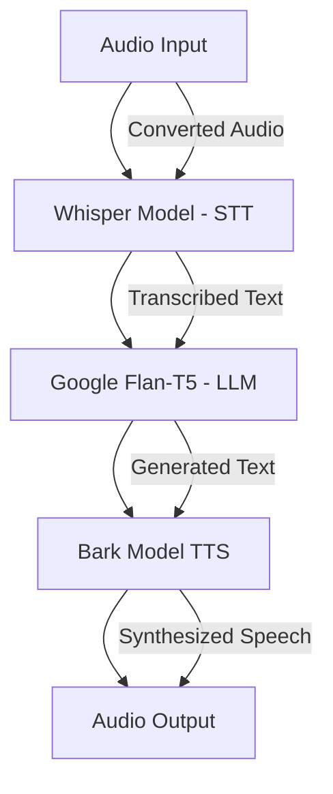

# Speech-to-Speech Language Model with Gradio Interface

## Overview
This project demonstrates a pipeline that integrates **Whisper** for speech-to-text (STT), **Google Flan-T5** for natural language generation (NLG), and **Bark** for text-to-speech (TTS), all combined into a simple **Gradio** interface. The user can record their voice, transcribe the audio, generate a response from an AI model, and convert the AI-generated response back to speech, making it a full speech-to-speech system.

  
*(Replace with actual diagram URL once available)*

## Key Libraries Used
- `transformers`: For loading pre-trained models like Google Flan-T5 for text generation.
- `whisper`: For accurate speech-to-text transcription.
- `bark`: For text-to-speech generation.
- `gradio`: To create an easy-to-use web interface.
- `librosa`: For audio pre-processing and conversion.
- `soundfile`: For writing audio data to files.

---

## Installation

To run this project, the following dependencies are required:

```bash
!pip install -q transformers==4.37.2
!pip install -q bitsandbytes==0.41.3 accelerate==0.25.0
!pip install -q git+https://github.com/openai/whisper.git
!pip install -q gradio
!pip install -q gTTS
!pip install -q huggingface_hub
!pip install -q bark
```

---

## Workflow

1. **Input Audio**: The user records their voice or uploads an audio file using the `Gradio` interface.
2. **Whisper Model**: This recorded audio is then passed to **Whisper** for transcription, which converts the speech into text.
3. **Flan-T5 Model**: The transcribed text is used as input for the **Flan-T5 XL** model, which generates a text-based response.
4. **Bark Model**: The generated text is converted back to speech using the **Bark** TTS model with a selectable speaker option (English male/female voices).
5. **Output Audio**: The AI-generated speech response is played back, and both the text and audio outputs are displayed.

---

## Detailed Code Flow

### 1. **CUDA Check**

```python
DEVICE = 'cuda' if torch.cuda.is_available() else 'cpu'
print(f"Using torch {torch.__version__} ({DEVICE})")
```
Checks if CUDA is available for faster model inference using the GPU.

### 2. **Loading Whisper Model (STT)**

```python
whisper_model = whisper.load_model("medium", device=DEVICE)
```
The Whisper model is loaded to transcribe speech to text. The `medium` variant is selected for balance between speed and accuracy.

### 3. **Loading Flan-T5 XL Model (NLG)**

```python
model_id = "google/flan-t5-xl"
quant_config = BitsAndBytesConfig(load_in_4bit=True, bnb_4bit_compute_dtype=torch.bfloat16)
pipe = pipeline("text2text-generation", model=model_id, model_kwargs={"quantization_config": quant_config})
```
This loads the **Google Flan-T5 XL** model with 4-bit quantization to optimize memory usage and improve performance.

### 4. **Loading Bark Model (TTS)**

```python
processor = AutoProcessor.from_pretrained("suno/bark")
bark_model = AutoModel.from_pretrained("suno/bark")
```
The **Bark** model is initialized to convert text into speech, using the `AutoProcessor` and `AutoModel` from Hugging Face's **Bark** repository.

### 5. **Audio Pre-processing Function**

```python
def convert_audio_to_whisper_format(audio_path):
    audio, sr = librosa.load(audio_path, sr=16000, mono=True)
    sf.write(processed_audio_path, audio, sr)
    return processed_audio_path
```
This function converts the input audio to 16kHz mono format, which is required by Whisper for accurate transcription.

### 6. **Transcription (Speech-to-Text)**

```python
def transcribe(audio):
    audio = whisper.load_audio(audio)
    mel = whisper.log_mel_spectrogram(audio).to(whisper_model.device)
    result = whisper.decode(whisper_model, mel)
    return result.text
```
The audio is passed to **Whisper** to get a text transcription. The model creates a log-mel spectrogram for speech recognition.

### 7. **Text-to-Speech using Bark**

```python
def text_to_speech_bark(text, speaker_id, file_path="output.wav"):
    audio_array = generate_audio(text, history_prompt=speaker_id)
    sf.write(file_path, audio_array, 24000)
    return file_path
```
Once the text is generated, it is passed to the **Bark** model, which synthesizes speech in the specified speaker's voice.

### 8. **End-to-End Audio Processing Function**

```python
def process_audio(audio_path, speaker):
    speech_to_text_output = transcribe(audio_path)
    llm_input = f"{llm_instruction}\nUser: {speech_to_text_output}"
    llm_response = pipe(llm_input)[0]['generated_text']
    processed_audio_path = text_to_speech_bark(llm_response, SPEAKERS[speaker])
    return speech_to_text_output, llm_response, processed_audio_path
```
This function ties everything together:
- Transcribes audio.
- Generates a response using **Flan-T5**.
- Converts the response back into speech using **Bark**.

### 9. **Gradio Interface**

```python
with gr.Blocks() as demo:
    audio_input = gr.Audio(type="filepath", label="Record your voice")
    speaker_dropdown = gr.Dropdown(choices=list(SPEAKERS.keys()), label="Select Speaker", value="english-male-1")
    transcript_output = gr.Textbox(label="Speech to Text")
    llm_output = gr.Textbox(label="LLM Response")
    audio_output = gr.Audio(label="Response as Audio")

    process_btn = gr.Button("Process Audio")
    clear_btn = gr.Button("Clear")

    process_btn.click(process_audio, inputs=[audio_input, speaker_dropdown], outputs=[transcript_output, llm_output, audio_output])
    clear_btn.click(clear_inputs, outputs=[audio_input, transcript_output, llm_output, audio_output])
```
A simple **Gradio** interface where the user can upload audio, select a speaker, and get the response text and audio.

---

## File Structure

```
.
├── README.md           <- You are here
├── main.py             <- Main code file
├── requirements.txt    <- Required Python libraries
├── output.wav          <- Sample output file
└── data/               <- Directory for audio files
```

---

## Usage

1. Clone this repository.
2. Install dependencies listed in `requirements.txt`.
3. Run the `main.py` file to start the **Gradio** interface.
4. Interact with the application by recording/uploading your voice, and choosing the desired speaker for output.

---

## Flow Diagram



---

## Future Additions

1. **Voice Activity Detection (VAD)**:
   - Implement a voice activation feature similar to "Hey Google" or "Alexa" that triggers the system when a specific phrase is detected. This will allow the model to be in a listening state, only processing speech after hearing the wake word.
   - Integrate with libraries like `webrtcvad` or use pre-trained VAD models to detect when the user begins speaking, improving efficiency by reducing unnecessary audio processing.

2. **Smarter Prompts for LLM**:
   - Introduce dynamic context-sensitive prompts for the language model (LLM), allowing it to better understand the nuances of the conversation.
   - For example, if the system detects a question, it will automatically add clarifying instructions, and for complex queries, it will request further context from the user.
   - Utilize reinforcement learning to make the system adaptive to different user inputs, improving response relevance over time.

3. **Memory Functionality**:
   - Add memory to the system so it can remember previous parts of the conversation during the same session. This will make the system capable of following context and understanding recurring themes or references.
   - The memory functionality will allow the model to track and reference previous inputs and responses, much like a chat history in conversational AI.
   - Store key conversation elements (e.g., user preferences or important data points) in session-level memory for more meaningful interactions.
   
4. **Enhanced Personalization**:
   - Offer more speaker and tone customization options, allowing users to choose different accents, speaking styles, or even emotional tones based on their preferences.
   - Integrate multi-lingual support for seamless transitions between languages within a single conversation.

5. **Longer Audio Context**:
   - Allow the system to handle longer audio inputs or monologues, enabling it to generate comprehensive responses for more detailed discussions or multi-turn conversations.
   - Include the ability to summarize long transcriptions and generate concise responses for ease of use.


